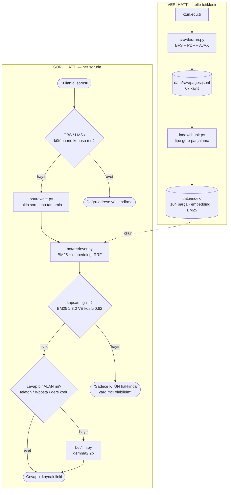

# KTÜN Destek Chatbotu

Konya Teknik Üniversitesi **Yapay Zeka ve Makine Öğrenmesi Mühendisliği bölümü** için,
sadece bölümle ilgili sorulara cevap veren destek chatbotu. Bilgi kaynağı üniversitenin
kendi sitesi (ktun.edu.tr); bilgi modele ezberletilmez, soru anında ilgili sayfalar bulunup
modele okutulur (**RAG**).

Hedef soru tipleri: **kişi/iletişim** · **tarih/takvim** · **ders/program** · **duyuru/haber**

## Kapsam: tek bölüm

Bot tüm üniversiteye değil, tek bölüme cevap veriyor. Sebep pratik: 31 bölümün tamamı
binlerce sayfa demek, ve arama havuzu büyüdükçe "hangi bölümün sınav takvimi" ayrımı
zorlaşıp yanlış bölümün cevabı dönüyor. Tek bölümde 67 kayıt, hepsi aynı birime ait —
`unit` alanına bakarak eleme yapmak gerekmiyor.

Çekilen 67 kaydın dağılımı: **41 PDF** (öğretim planı, 4 dönem ders programı, 10 sınav
takvimi, staj belgeleri, kalite/süreç dosyaları) · 11 sayfa · 9 personel (8 hoca + liste) ·
4 tablo (AKTS ders listeleri) · 2 duyuru.

Hocaların akademik geçmişi ve verdiği dersler kişi sayfalarının AJAX sekmelerinden geliyor;
bir hoca = bir kayıt (sekmeler ayrı kayıt olsaydı hepsi aynı URL'e düşerdi). Yayın listeleri
(makale, kitap, bildiri) bilerek toplanmıyor — hedef soru tipleri kişi/ders odaklı.

> Bölümün "Öğretim Planı", "Ders Programı", "Sınav Programları" sayfalarının **metni
> neredeyse boştur** — sadece PDF linkleri taşırlar. Asıl içerik `/Dosyalar/**.pdf`
> altında, yani `/tr/Birim/` dışında. Bu yüzden `--sadece-birim` PDF'leri elemez
> (`crawler/run.py:ekle`); elerse bölümün ders ve sınav verisinin tamamı kaybolur.

---

## Nasıl çalışıyor?

Sistem iki bağımsız hattan oluşuyor. Soldaki hat **verinin hazırlanması** (elle
tetiklenir), sağdaki hat **sorunun cevaplanması** (her soruda çalışır).



Üç tasarım kararı bu şemayı belirliyor:

**Model bilgiyi ezberlemez.** Veri güncellemek = crawler'ı tekrar çalıştırmak, saatlerce
eğitim değil. 2B'lik model yeterli çünkü ondan bilgi değil, **okuduğunu anlatması** isteniyor.

**Kapsam kapısı modelden ÖNCE.** Alakasız soruda model hiç çalışmaz — uydurma şansı bulamaz.

**Yapısal cevaplar modeli atlar.** Telefon, e-posta, ders kredisi gibi bilgiler metinde bir
alan olarak duruyor; bunları modele yazdırmanın faydası yok. O sorular model kalitesinden
bağımsız ve anlık.

---

## Kurulum

```bash
pip install -r requirements.txt
```

Model çalıştırmak için ayrıca [Ollama](https://ollama.com) gerekir:

```bash
ollama pull gemma2:2b
```

---

## Çalıştırma

Veri çek (A tarafı) → indeksle → sohbet et:

```bash
python -m crawler.run --seed <bölüm-url> --sadece-birim --derinlik 2 --max-sayfa 200
```

```bash
python -m index.build_index --input data/raw/pages.jsonl
```

```bash
python -m bot.cli
```

Crawler çalıştırmadan denemek için indeks örnek veriden de kurulabilir
(`--input` verilmezse `data/sample/pages.sample.jsonl` kullanılır).

### Diğer komutlar

```bash
python -m bot.cli --no-llm "bölümde hangi hocalar var"
```

```bash
python -m eval.retrieval_test
```

```bash
python -m eval.answer_test
```

```bash
python scripts/validate_jsonl.py data/raw/pages.jsonl
```

```bash
python scripts/make_sample.py
```

CLI içinde: `/kaynak` (son cevabın kaynakları), `/temizle` (hafızayı sıfırla), `/cik`.

Veri güncellemek = crawler'ı tekrar çalıştırmak; `--sifirdan` verilmezse mevcut
kayıtlarla birleştirir.

---

## Kapsam kapısı nasıl ayarlandı

Alakasız soruda modelin hiç çalışmaması gerekiyor. Bunun için bir eşik lazım, ve
eşik **tahminle değil ölçümle** kondu. Ölçüm (18 kapsam içi / 6 kapsam dışı soru):

| | BM25 | kosinüs |
|---|---|---|
| kapsam içi | 3.20 – 20.89 | 0.832 – 0.876 |
| kapsam dışı | 0.00 – 3.83 | 0.797 – 0.843 |

**İki aralık da çakışıyor** — hiçbir sinyal tek başına ayıramıyor. Ama çakışmalar
farklı sorulardan geliyor:

- *"aşk şiiri **yaz**"* → BM25 yüksek (staj metinlerindeki "yaz" ile eşleşiyor),
  kosinüs düşük
- *"bugün günlerden ne"* → kosinüs yüksek, BM25 sıfır

İkisini **birden** şart koşunca ayırım tam oluyor. Ayrıca çok yüksek kosinüs
(≥ 0.85) tek başına yeterli sayılıyor: *"Staj yapmak için ne gerekiyor"* BM25'te
2.35 alıp reddediliyordu, kosinüsü 0.868 — kapsam dışı hiçbir sorunun ulaşamadığı
seviye.

---

## Ölçüm sonuçları

Tek bölüm verisiyle (67 kayıt → 104 parça) ölçüldü.

**Arama** (`eval/retrieval_test.py`, model çalıştırılmadan):

| Ölçüt | Sonuç | Hedef |
|---|---|---|
| Doğru kaynak ilk 4'te | **17/18 (%94)** | %80 |
| kişi / tarih / ders / duyuru | %100 / %100 / %83 / %100 | %70 |
| Kapsam dışı sızıntı | **0/6** | 0 |
| Kapsam içi yanlış ret | **0/18** | 0 |

**Cevap** (`eval/answer_test.py`):

| Ölçüt | Sonuç |
|---|---|
| Cevap doğruluğu | **7/8 (%88)** |
| Kapsam dışı reddi | 2/2 |
| Yönlendirme | 1/1 |
| Sohbet hafızası | çalışıyor |
| Süre | 12–62 sn/soru (CPU, gemma2:2b) |

**Model seçimi:** `gemma2:2b` varsayılan. `qwen2.5:1.5b-instruct` beş kat hızlı
ama bağlamdaki cevabı göremiyor — telefon numarası bağlamın 1. parçasında apaçık
dururken "bilgi yok" diyordu. Doğruluk hızın önünde tutuldu.

### Colab T4'te model karşılaştırması

Lokalde NVIDIA GPU yok, 2B üstü model denenemiyordu. Tavanı görmek için aynı 8
soru Colab'ın T4'ünde 4-bit nicelemeyle ölçüldü
([`notebooks/model_karsilastirma.ipynb`](notebooks/model_karsilastirma.ipynb)).
Arama zinciri ve promptlar birebir aynı; değişen tek şey `bot/llm.py` yerine
`generate()` sözleşmesini sağlayan bir Colab backend'i.

| Model | Doğruluk | Kapsam dışı reddi | sn/soru |
|---|---|---|---|
| Qwen2.5-1.5B-Instruct | 6/8 (%75) | 2/2 | 10.1 |
| **Qwen2.5-7B-Instruct** | **8/8 (%100)** | 2/2 | 12.7 |

**Ne çıkarıyoruz:** boyut bu görevde işe yarıyor ve ucuza geliyor — 7B, 1.5B'nin
dört katı parametreyle soru başına yalnızca 2.6 saniye daha alıyor (GPU'da
darboğaz üretim değil, model yükleme ve bellek). 7B'nin 8/8'i, sistemin
kalan hatasının aramada değil modelde olduğunu da gösteriyor: aynı bağlamla
lokal 2B 7/8 yapıyordu, 7B aynı bağlamdan 8/8 çıkarıyor.

**Bu tablonun söylemedikleri:**
- `google/gemma-2-*` ölçülemedi (HF'de kapalı repo, lisans onayı + token
  istiyor). Yani lokal varsayılanın GPU'daki karşılığı tabloda **yok**;
  7B ile gemma2:2b arasındaki fark doğrudan değil, lokal ölçümle dolaylı
  kıyaslanıyor.
- Qwen2.5-1.5B burada 6/8 yaptı; lokalde (Ollama, `q4_K_M`) bundan belirgin
  kötüydü. Aynı model ailesi, farklı niceleme ve farklı sohbet şablonu —
  hangisinin etkili olduğu ölçülmedi, dolayısıyla "1.5B aslında iyiymiş"
  demek için erken.
- 8 soruluk kümede tek soru %12.5 ediyor; bu tablo sıralama verir, ince fark
  vermez.

**Karar:** lokal varsayılan `gemma2:2b` olarak kalıyor — 7B bu makinede zaten
çalışmıyor, karşılaştırma bir seçim değil tavan ölçümü. Değeri şurada: GPU'lu
bir ortama taşınırsa doğruluk %88'den %100'e çıkıyor ve süre 12-62 sn'den
~13 sn'ye iniyor. Kod tarafında hiçbir değişiklik gerekmiyor.

### Bilinen kusurlar
- "Birinci dönem dersleri neler" sorusunda görev tanımı PDF'i 1. sırada; doğru
  belge (öğretim planı) 3. sırada, cevap bağlama giriyor ama sıralama ideal değil.
- Bu bölümün iletişim sayfasında **telefon ve e-posta yok**, sadece adres var.
  `bot/extract.py`'nin telefon/e-posta çıkarımı bu veride devreye girmiyor —
  kod sorunu değil, sitede o bilgi yok (telefon rehberi uçları da boş dönüyor).
- CPU'da soru başına yarım dakikayı bulabiliyor. GPU'lu bir ortamda saniyeler.

---

## Ölçümle bulunan tuzaklar

Hiçbiri hata mesajı vermiyor — sistem çalışıyor görünüp yanlış cevap veriyor.

| # | Belirti | Kök sebep | Çözüm |
|---|---|---|---|
| 1 | Türkçe arama tutmuyor | `"İ".lower()` fazladan U+0307 üretiyor | `common/normalize.py` |
| 2 | Sayfa bulunamıyor | `brm` Base64'ünde `+` boşluğa dönüyor | URL yeniden encode edilmiyor |
| 3 | Model bağlamdaki cevabı görmüyor | Kaçış cümlesi promptta birebir yazılıydı, model kopyalıyordu | Etiket (`BILGI_YOK`) |
| 4 | Talimat takibi bozuk | `/api/generate` sohbet şablonunu uygulamıyor | `/api/chat` |
| 5 | Model ders adı uyduruyor | 20 personel parçası bağlamı dolduruyor | Kaynak başına kota |
| 6 | Kadro listesi hiç görünmüyor | RRF zayıflığı: BM25'te 1., kosinüste 34. | Her yöntemin birincisine slot |
| 7 | Müfredat/çizelge karışıyor | Ayırt edici bilgi başlıkta, gövdede değil | Başlık eşleşme bonusu |
| 8 | Kişi soruları form belgelerine düşüyor | Görev tanımı PDF'leri aynı kelimeleri içeriyor | Belge sınıfı + ceza |
| 9 | "peki" ile başlayan soru reddediliyor | Bağlaç BM25 ağırlığını sulandırıyor | Takip bağlaçları ayıklanıyor |

Bu tablo projenin en öğretici çıktısı. Ortak noktaları: **hiçbiri çökmüyor, hiçbiri
log basmıyor.** Sistem sağlıklı görünürken yanlış cevap veriyor. Hepsi ancak ölçüm
yazıldıktan sonra görülebildi — bu yüzden `eval/` klasörü modelden önce yazıldı.

İki tanesi ayrıca genel ders niteliğinde:

**#6 — RRF'in kör noktası.** Reciprocal Rank Fusion iki sıralamayı toplar. Bir yöntemde
1., diğerinde 34. olan parça tek katkı alır (1/61) ve *iki yöntemde de vasat* olan
parçalara (iki katkı) yenilir. Kadro listesi tam olarak bu durumdaydı: BM25'in
tartışmasız birincisi, sonuçlarda yok. Çözüm her yöntemin birincisine slot ayırmak.

**#3 — Küçük modelde kaçış cümlesi.** Prompt'a "cevap yoksa şunu yaz: ..." diye
hazır bir cümle koymak, 1.5B modele en kolay token yolunu vermek demek. Model o
cümleyi kopyalamayı öğreniyor ve bağlamdaki cevabı görmezden geliyordu (doğruluk 1/8).
Cümle yerine modelin doğal üretmeyeceği bir etiket (`BILGI_YOK`) konunca kısayol kapandı.

---

## Kim neyi yazıyor?

Proje 2 kişilik ve **kimse kimseyi beklemez**. İki taraf birbirinin koduna değil,
sadece [`SCHEMA.md`](SCHEMA.md)'deki `pages.jsonl` formatına bağlıdır.

| Kişi | Sahibi olduğu klasörler | Girdi | Çıktı |
|---|---|---|---|
| **A — Veri** | `crawler/`, `scripts/` | ktun.edu.tr | `data/raw/pages.jsonl` |
| **B — Bot** | `index/`, `bot/`, `notebooks/`, `eval/` | `pages.jsonl` | CLI cevabı |
| Ortak | `common/`, `SCHEMA.md`, `requirements.txt` | — | küçük, nadir değişir |

Bağımsızlığı sağlayan iki şey:
- **`data/sample/pages.sample.jsonl`** (67 gerçek sayfa, repoda) → `data/raw/` gitignore'da,
  yani repoyu klonlayan biri crawler'ı çalıştırmadan elinde veri bulamaz. Örnek dosya
  crawler çıktısından üretilir (`scripts/make_sample.py`); gerçek veriye geçmek tek şey
  değiştirir: `--input` yolu, kod değişmez.
- **`--backend dummy`** → B, model kurulumunu beklemeden arama zincirini test eder.

Branch düzeni: `feat/crawler` (A) ve `feat/bot` (B), günlük PR.
`data/` klasörü `.gitignore`'da — sadece `data/sample/` commit'lenir.

---

## Siteden öğrenilenler (crawler yazarken bunlara dikkat)

Site canlı olarak incelendi. Sunucu tarafında render ediliyor → `requests` yeterli,
Selenium **gerekmiyor**. `robots.txt` ve `sitemap.xml` **yok** → ana sayfadan BFS crawl şart.

| Konu | Bulgu |
|---|---|
| İçerik kabı | `<main id="mainContent">` |
| Yan menü | `mainContent` **içinde** — alt sayfaları keşfetmek için gerekli, ama metne girerse tüm sayfalar birbirine benzer. `.gdlr-core-pbf-sidebar-left` silinir |
| Bölümler | Ana menüde **yok**. Ana menü → Fakülte → "Bölümler" (2 kademe). 31 bölüm bulundu |
| `brm` id | **Sayfa başına**, birim başına değil → URL'ler tahmin edilemez, menüden keşfedilir |
| Akademik takvim | Sayfa metninde yok, **`<iframe>` içindeki PDF**'te (metin tabanlı, OCR gerekmez) |
| Ders listesi | Sayfa boş görünür; asıl liste `GET /tr/Birim/BolumDersListesiGetir?id=<id>` ucunda. id `onclick="derslistegetir(5018)"` içinde |
| Hoca sayfası | Sekmeler AJAX: `POST /tr/Universite/<sekme>` + `id=<token>`, token `onclick="Sayfa_Getir(...)"` içinde. Sayfanın kendi metni sadece ad + fakülte + bölüm (261 chr). Hoca adı `<h6>`'da — h1/h2 herkeste "Akademik Personel" |
| Telefon rehberi | `TelefonRehberiAramaDetay` / `TelefonRehberiBirimDetay` uçları **boş tablo dönüyor**; rehberde veri yok. Telefon/e-posta bu yüzden toplanamıyor |
| Duyuru başlığı | Sayfada **iki `<h1>`** var; ilki jenerik ("Duyuru Detay"), ikincisi gerçek başlık |

Bu tabloyla ilgili iki kritik kural yukarıdaki [tuzaklar tablosunda](#ölçümle-bulunan-tuzaklar)
detaylı: URL'ler yeniden encode edilmez (#2) ve `.lower()` Türkçe'de kullanılmaz (#1).

---

## Kapsam dışı

**Diğer 30 bölüm ve genel üniversite sayfaları** — bot tek bölüme cevap veriyor (yukarı bak) ·
login arkasındaki kişisel veri (not, transkript, ders kaydı) — OBS'ye yönlendirilir ·
İngilizce sayfalar · alt alan adları (`obs`, `lms`, `kutuphane`…) — yalnızca yönlendirme ·
`.docx`/`.xlsx` ekler (staj formları, 2024-2025 güz sınav takvimleri) — metne çevrilmiyor,
`scope.DISLANAN_UZANTILAR` içinde.
